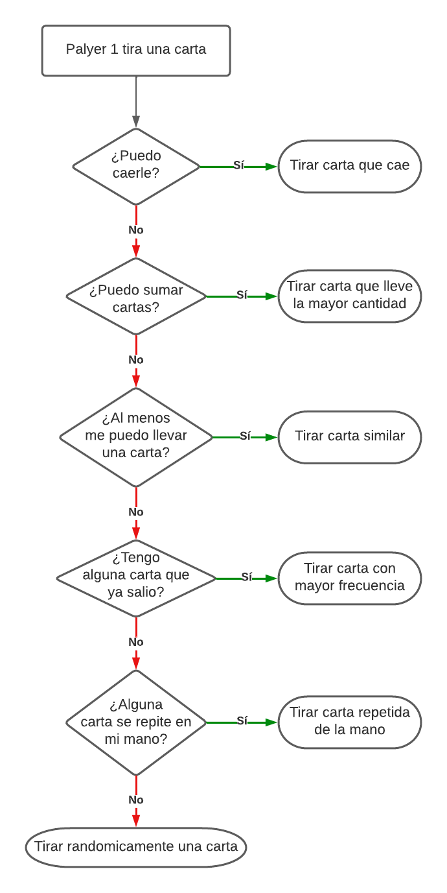

# Game of "Cuarenta"
## Overview
The game of "Cuarenta" is a traditional Ecuadorian game specifically from Quito. It can be played between 2 or 4 and the first to reach 40 points wins.
## Used libraries
- Collections
- Random
## Decision making based on rules of the Expert Agent
<p align="center"></p>
## How to run
Linux/Ubuntu
```
$ python3 Cuarenta.py
```
